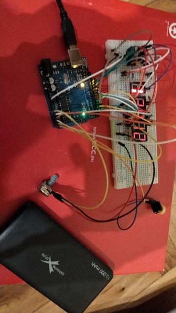
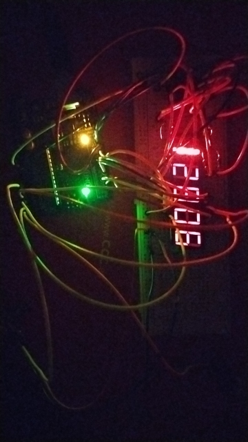

# 7-Segment Displays 🎉

This project demonstrates my ability to use, compose, and interface with the (microcontroller) hardware described below. 🚀

## Project in Action 📸
Here are some images showing my running `CountUpTo99999` program.

 🌞
 🌚

## Project contents 🛠️
### Software 💻 – counter apps
* Current: `CountUpTo99999` program.
* Alternative: `CountUpTo*` programs.
### Hardware 🔧
* **Controllers**: Arduino board, shift register
* **2 LED displays** – 1+4 digits – 5·7 led segments 💡
* **User interface**: button, knob (variable resistor)
* Wires 🔌
* Electricity source ⚡

## Features ✨
* Tap yellow **button** 🔳 **to reset** 🔄 a running counter 
* Use the **knob** 🎚️ on variable resistor **to control the time speed** ⏳

## Repository Contents 📂

- _7-segment_displays.ino_ – The main Arduino sketch for controlling the 7-segment displays. 💾
- _\*.inc_ – files included by the main sketch. 📝
- Other ordinary files. 🗂️

## License 📜
This project is licensed under the GNU GENERAL PUBLIC LICENSE - see the LICENSE file for details.
